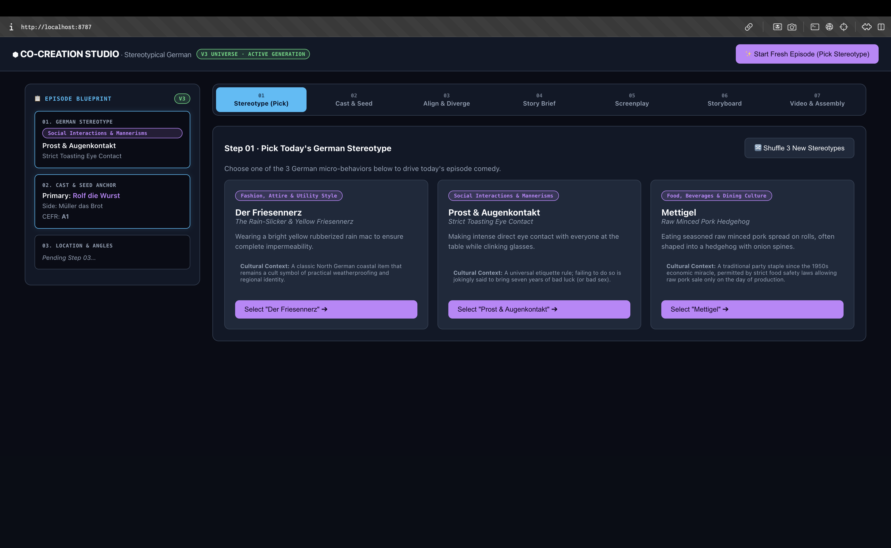
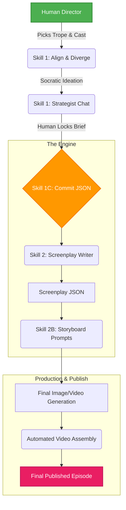

# 🎬 Stereotypical German: AI Co-Creation Studio

   

> **A human-in-the-loop, AI-driven pipeline for generating highly consistent, episodic cinematic content.**

### 🔗 [Watch the 2-Minute Studio Demo Video Here](#) *(Replace this with your Loom/YouTube link)*

---

## 🎯 The Mission: Ethical & Scalable Creative AI
Generative AI is powerful, but often lacks the strict consistency and directed storytelling required for professional production. This Co-Creation Studio is built to **enhance, not replace, human creativity.** 

Instead of typing individual prompts into a vacuum, human directors use a real-time, Socratic chat interface to lock in the comedic angle, location, and beats of a scene. The AI then automatically constructs a highly rigid **Story Brief**, translates it into a precise **Screenplay**, and generates locked **Storyboard Prompts**—guaranteeing that character identity, physical traits, and visual styles remain perfectly consistent across every episode.

---

## 📸 Inside the Studio

### Step 1: Browse the Compendium
The pipeline runs on a curated library of 100 German micro-cultural behaviors. Directors can search the compendium and select a specific behavioral trope to anchor the episode.
<br>
 *(Drop your Step 1 UI screenshot here)*

### Step 2: Real-Time Socratic Co-Creation
The AI acts as a creative strategist, pushing back on weak ideas and helping the director shape the narrative arc within strict pedagogical and cinematic constraints.
<br>
 *(Drop your Chat UI screenshot here)*

### Step 3: Automated Pipeline Execution
Once the director locks the brief, the backend engine takes over, executing a multi-stage prompt chain.

---

## ⚙️ The Pipeline Architecture

The system uses a strict pipeline to prevent AI hallucinations and maintain stylistic control. Each stage passes rigidly formatted JSON payloads to the next.



### Key Technical Features
- **Deterministic JSON Enforcement:** AI responses are strictly parsed and validated against predefined schemas.
- **Reference Binding:** Wardrobe and facial features are mathematically locked to reference sheets, preventing stylistic drift.
- **Supabase Ledger Tracker:** Every API call, token usage, and pipeline state is logged in a PostgreSQL database for full run-resumption and cost auditing.

---

## 🚀 Local Setup & Installation

If you'd like to spin up the Co-Creation Studio locally:

1. **Clone the repository:**
   ```bash
   git clone https://github.com/yourusername/anki-video.git
   cd anki-video
   ```

2. **Set up the virtual environment:**
   ```bash
   python -m venv .venv
   source .venv/bin/activate
   pip install -r requirements.txt
   ```

3. **Configure API Keys:**
   Copy `.env.example` to `.env` and add your LLM API keys (Anthropic/Gemini) and Supabase credentials.

4. **Run the Dashboard:**
   ```bash
   python -m uvicorn dashboard.app:app --port 8787
   ```
   Open `http://localhost:8787/static/index.html` in your browser.

---

*Built by [Jayon K. Vinod](https://github.com/yourusername)*
