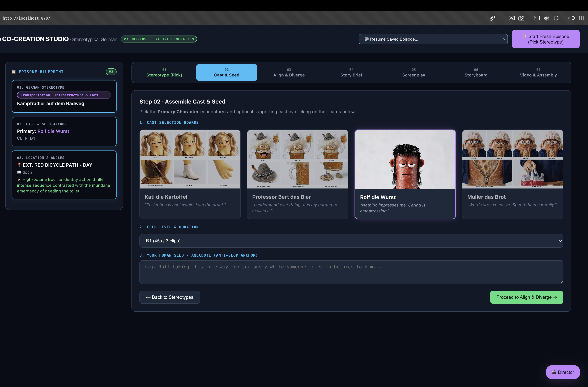
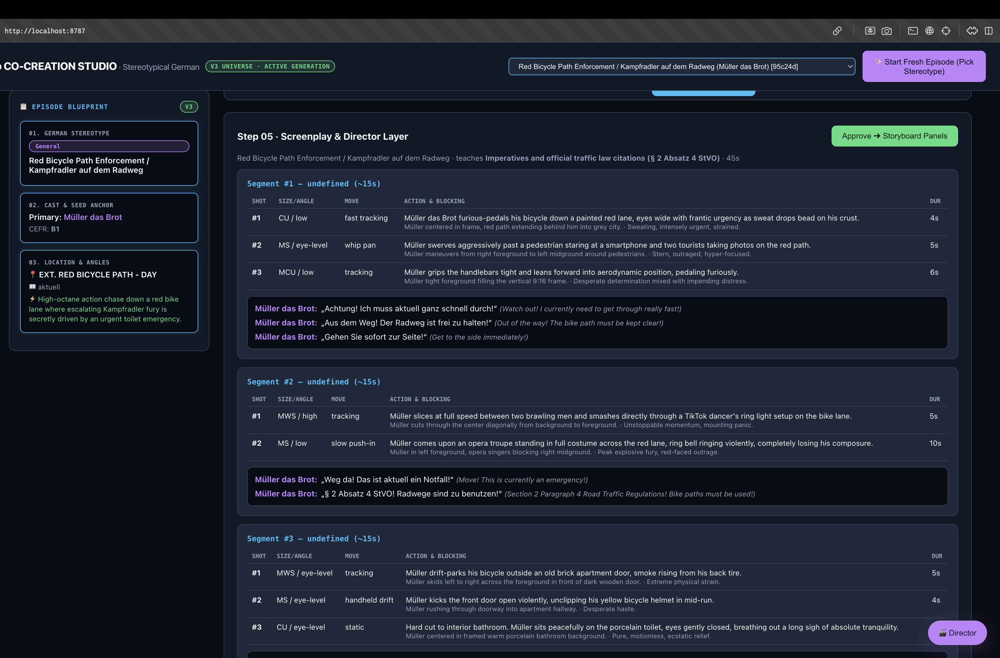

# 🎬 AI Co-Creation Studio

   

### 🔗 [Watch the 2-Minute Studio Demo Video Here](#) 

Welcome to my custom **AI Co-Creation Studio**. I built this tool to make AI filmmaking more controllable, consistent, and scalable. Instead of typing random prompts, human directors use this studio to lock in the story, and the AI handles the heavy lifting of maintaining perfect character consistency across episodes.

---

## 🎭 The Cast
The studio strictly maintains the visual identity of these 4 recurring characters across all generated videos:

<div style="display: flex; gap: 10px;">
  <div align="center">
    <br>
    <b>Kati die Kartoffel</b>
  </div>
  <div align="center">
    <br>
    <b>Professor Bert</b>
  </div>
  <div align="center">
    <br>
    <b>Rolf die Wurst</b>
  </div>
  <div align="center">
    <br>
    <b>Müller das Brot</b>
  </div>
</div>

---

## 📸 How it Works

The studio guides the director through a simple, step-by-step process:

### 1. Pick a Story & Cast
The director searches a library of 100 story ideas and selects the characters for the episode. 
<br>
 

### 2. Chat with the AI Co-Director
Instead of guessing prompts, the director chats with an AI assistant to flesh out the scene, location, and comedic angle.
<br>


### 3. Automated Video Generation
Once the story is locked, the backend automatically writes the screenplay, generates the storyboard prompts, and pieces together the final video using strict character references to guarantee everything looks consistent.

---

## 🚀 Run it Locally

1. **Clone & Install:**
   ```bash
   git clone https://github.com/jayonkv137/anki-video.git
   cd anki-video
   python -m venv .venv
   source .venv/bin/activate
   pip install -r requirements.txt
   ```

2. **Add API Keys:**
   Copy `.env.example` to `.env` and add your LLM API keys (Anthropic/Gemini) and Supabase credentials.

3. **Start the Studio:**
   ```bash
   python -m uvicorn dashboard.app:app --port 8787
   ```
   Open `http://localhost:8787/static/index.html` in your browser.

---
*Built by [Jayon K. Vinod](https://github.com/jayonkv137)*
